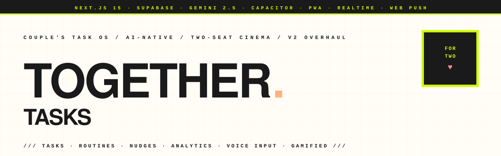

<p align="center">
  <picture>
    <source media="(prefers-color-scheme: dark)" srcset="assets-readme/hero-banner-dark.svg" />
    
  </picture>
</p>

<p align="center">
  <a href="https://github.com/hatimhtm/together-tasks/actions/workflows/ci.yml"></a>
  
  
  
  
  
  
</p>

<p align="center">
  <em>An AI-native task OS built for a household of two. Type a sentence, hold the mic, or hit "@partner" — Gemini extracts the title, due date, priority, urgency, importance, and estimated duration, breaks long jobs into subtasks, and routes the result to the right queue. Realtime Supabase channels keep both phones in sync. Routines, gamification (XP / streaks / levels), nudges, weekly reviews, push notifications, and a 12-week activity heatmap sit on top. Web + installable PWA + native Android via Capacitor. Hardcoded for one pair, by design.</em>
</p>

---

### `/// SURFACE AREA`

```
┌──────────────────────────────────────────────────────────────────────┐
│ TAB BAR (mobile bottom nav / desktop sidebar)                        │
│ ▸ Home · Routines · Nudge · Stats · Settings                         │
├──────────────────────────────────────────────────────────────────────┤
│ HOME                          │ ROUTINES (v2)                        │
│ ▸ Smart quick-add             │ ▸ Daily/weekly/custom shared habits  │
│   (type · voice · @partner)   │ ▸ 7-day strip + partner trail        │
│ ▸ AI Nudge card               │ ▸ Streak per routine                 │
│ ▸ Today / Upcoming / Done     │ ▸ XP on every completion             │
│                               │                                      │
│ STATS (v2)                    │ NUDGE                                │
│ ▸ XP + level + streak         │ ▸ AI-personalised affectionate ping  │
│ ▸ Couple completion donut     │ ▸ Send "thinking of you" pulse       │
│ ▸ 12-week activity heatmap    │                                      │
│ ▸ Weekly fairness bar         │ WEEKLY REVIEW                        │
│ ▸ Best day / best hour        │ ▸ Sunday recap                       │
│                               │ ▸ Goals + vision board               │
├──────────────────────────────────────────────────────────────────────┤
│ CAPACITOR ANDROID WRAPPER                                            │
│ ▸ Same Next.js build (CAPACITOR_BUILD=true → static export)          │
│ ▸ Haptics · local notifications · auto-updater                       │
└──────────────────────────────────────────────────────────────────────┘
```

---

### `/// WHY IT EXISTS`

Most task apps target a billion users in a feed. Together Tasks targets two people, one fridge, and the question *"did anyone schedule the optometrist this week?"* Built around the **two-seat gate** pattern — only the two emails in `AUTHORIZED_EMAILS` can sign in, everyone else gets politely turned around at the door.

Type *"Pick up rosemary tomorrow evening"* and Gemini extracts the title, sets the due date to tomorrow 19:00, classifies it as low-urgency, estimates 10 minutes, and decides not to bother with subtasks. Say it out loud instead — same flow, hold the mic on the quick-add. Tick it complete and the streak ticks, the XP bar climbs, the couple-fairness bar adjusts for the week, the activity heatmap colours another cell.

It is hardcoded for a household of two. Forking and pointing it at your own Supabase + Gemini keys is fine; running it as a multi-tenant SaaS is not.

---

### `/// V2 — THE BIG OVERHAUL`

The 1.0 build shipped as an AI-native task manager. v2 is a substantial product + hygiene pass:

- **🔁 New flagship feature: Routines.** A separate surface for repeatable shared habits, distinct from one-off tasks. Daily / weekdays / weekends / custom-days cadence. Each completion logs a row in `routine_completions`, awards XP via a Postgres trigger, contributes to a per-routine streak that the card visualises with a 7-day strip + partner trail.
  - Schema: `supabase/migrations/20260512000001_add_routines.sql`
  - UI: `src/app/(dashboard)/routines/` + `src/components/routines/`
- **📊 Analytics + insights overhaul.** Three new hand-rolled SVG viz primitives, no chart library:
  - **CoupleDonut** — lifetime completion split per partner with animated stroke segments.
  - **WeekdayHeatmap** — 12-week GitHub-style activity heatmap, intensity bucketed against the period's max.
  - **FairnessBar** — single-bar 50/50 split for the week with a balanced/leaning chip.
- **🎙️ Voice-to-task.** A mic button on the quick-add wires the Web Speech API into the existing `parseTaskInput` → Gemini → `addTask` pipeline. Live interim transcript renders into the textarea; final transcript stays editable before submit. Graceful degradation on browsers without `SpeechRecognition`.
- **🧹 Ship-ready hygiene.**
  - Personal data env-gated: `queen@example.com` and "King Hatim / Queen Pookie" pulled into `NEXT_PUBLIC_KING_EMAIL` / `NEXT_PUBLIC_QUEEN_EMAIL` / `NEXT_PUBLIC_KING_LABEL` / `NEXT_PUBLIC_QUEEN_LABEL` / `NEXT_PUBLIC_KING_HANDLES`.
  - VAPID push contact moved to `VAPID_CONTACT` env.
  - Repo cleanup: removed checked-in `.DS_Store`, dual lockfiles (`bun.lock` deleted, project standardised on npm), the dead `next.config.js` (had hardcoded `output: 'export'` that would have broken Vercel), and 31 files of Stitch UI prototypes (~3.7 MB).
  - `next.config.mjs` now handles Capacitor static-export conditionally via `CAPACITOR_BUILD=true`.
- **🤖 CI.** New `.github/workflows/ci.yml` runs `npm test` + `npm run build` on every push with stub env vars, so a broken main branch can never sneak into Vercel.

---

### `/// STACK`

```
NEXT.JS 15           App Router · server components · server actions
SUPABASE             Postgres + Auth + Realtime channels + RLS
GEMINI 2.5 FLASH     Natural-language task parsing · subtask breakdown
                     · duration estimation · urgency / importance scoring
                     · personalised nudges
CAPACITOR 8          Android wrapper · haptics · local notifications
                     · auto-updater
NEXT-PWA + WEB-PUSH  Installable PWA, server-sent push
TAILWIND 4           Token-driven theming · material symbols
FRAMER MOTION 12     Layout transitions · stagger · spring physics
RADIX UI + ZUSTAND   Headless primitives · light state store
DATE-FNS + RRULE     Calendar logic · recurring tasks
SONNER + CONFETTI    Toasts · celebratory feedback
ZERO CHART LIBS      All visualisations are hand-rolled SVG
```

---

### `/// PROJECT LAYOUT`

```
together-tasks/
├── src/
│   ├── app/
│   │   ├── (auth)/login/         email + password + two-seat gate
│   │   ├── (dashboard)/
│   │   │   ├── page.tsx          Home — quick-add, AI nudge, tasks
│   │   │   ├── routines/         v2 Routines surface
│   │   │   ├── nudge/            AI nudge inbox
│   │   │   ├── analytics/        v2 — donut + heatmap + fairness
│   │   │   ├── calendar/         month view
│   │   │   ├── goals/            vision board
│   │   │   ├── weekly-review/    Sunday recap
│   │   │   ├── profile/          per-user profile
│   │   │   └── settings/         theme · notifications · partner link
│   │   ├── onboarding/           5-step welcome
│   │   └── love-verification/    pair-bonding ritual gate
│   ├── components/
│   │   ├── ai/                   chat widget · nudge generators
│   │   ├── analytics/            v2 viz primitives
│   │   ├── dashboard/            home composition
│   │   ├── routines/             v2 Routines components
│   │   ├── tasks/                quick-add · voice button · task list
│   │   ├── partner/              link-code flow
│   │   ├── pwa/                  install prompt · update toast
│   │   ├── location/             home/work proximity nudges
│   │   ├── layout/               header · bottom-nav
│   │   ├── settings/             notification prompts · prefs
│   │   └── ui/                   button, card, glass-card primitives
│   ├── lib/
│   │   ├── ai/                   task-parser · task-analyzer
│   │   ├── supabase/             client / server / admin
│   │   ├── notifications/        briefing scheduler · partner-notify
│   │   ├── web-push/             VAPID sender
│   │   ├── constants.ts          env-gated couple identifiers
│   │   ├── user.ts               display-name resolver
│   │   ├── haptics.ts            Capacitor + web fallback
│   │   └── geolocation.ts        home/work radius
│   └── types/                    Task · Profile · Routine
├── supabase/
│   ├── schema.sql                base tables + RLS
│   └── migrations/               13 dated migrations
│       └── 20260512000001_add_routines.sql   ← v2 routines
├── android/                      Capacitor wrapper
├── public/                       icon · manifest · static
└── .github/workflows/ci.yml      v2 — test + build gate
```

---

### `/// LOCAL DEV`

```bash
git clone https://github.com/hatimhtm/together-tasks.git
cd together-tasks
cp .env.example .env.local       # fill in Supabase + Gemini + couple emails
npm install
npm run dev                      # http://localhost:3000
npm test                         # node --test src/**/*.test.ts
npm run build                    # Vercel build
npm run capacitor:build          # static export → npx cap sync (Android)
```

**Supabase setup** — create a project, then run the schema + migrations in order:

```bash
psql "$DATABASE_URL" < supabase/schema.sql
for f in supabase/migrations/*.sql; do psql "$DATABASE_URL" < "$f"; done
```

**Vercel** — push, import, paste env vars from `.env.example`. The `main` branch auto-deploys.

---

### `/// CUSTOMISATION`

- **Who can log in**: `NEXT_PUBLIC_KING_EMAIL` + `NEXT_PUBLIC_QUEEN_EMAIL`. The Queen routes through the love-verification gate after onboarding; the King goes straight to the dashboard.
- **Display labels**: `NEXT_PUBLIC_KING_LABEL` + `NEXT_PUBLIC_QUEEN_LABEL` (e.g. `King Hatim`, `Queen Pookie`). Default to "King" / "Queen".
- **AI personality**: see `src/lib/ai/task-parser.ts` system prompt — change the time-of-day mapping or subtask cap to fit your household.
- **Themes**: 3 built-in (`daylight`, `dusk`, `oled`) — picked during onboarding, applied via `data-theme` on `<body>`.
- **Cron jobs**: web-push briefings + weekly reviews are scheduled client-side via `lib/notifications/briefing-scheduler.ts`. To server-cron them, wire `/api/cron/briefings` against your platform's cron.

---

### `/// LICENSE`

**Source-visible, no production reuse.** Together Tasks is a personal household project published for the curiosity of other engineers — read the code, fork it for a single private instance, study the AI parsing prompts and Realtime patterns. **You are not welcome** to sell it, re-host it as SaaS, strip the two-seat gate for multi-tenant use, or train ML models on it.

For commercial licensing, [get in touch](mailto:king@example.com).

---

<p align="center">
  <a href="https://hatimelhassak.is-a.dev"></a>
  <a href="https://cal.com/hatimelhassak/engineering-discovery"></a>
  <a href="https://www.linkedin.com/in/hatim-elhassak/"></a>
  <a href="mailto:king@example.com"></a>
</p>

<p align="center">
  <code>///&nbsp;&nbsp;OPEN FOR NEW WORK&nbsp;&nbsp;///&nbsp;&nbsp;CONTRACT &amp; FREELANCE&nbsp;&nbsp;///&nbsp;&nbsp;REMOTE WORLDWIDE&nbsp;&nbsp;///</code>
</p>
